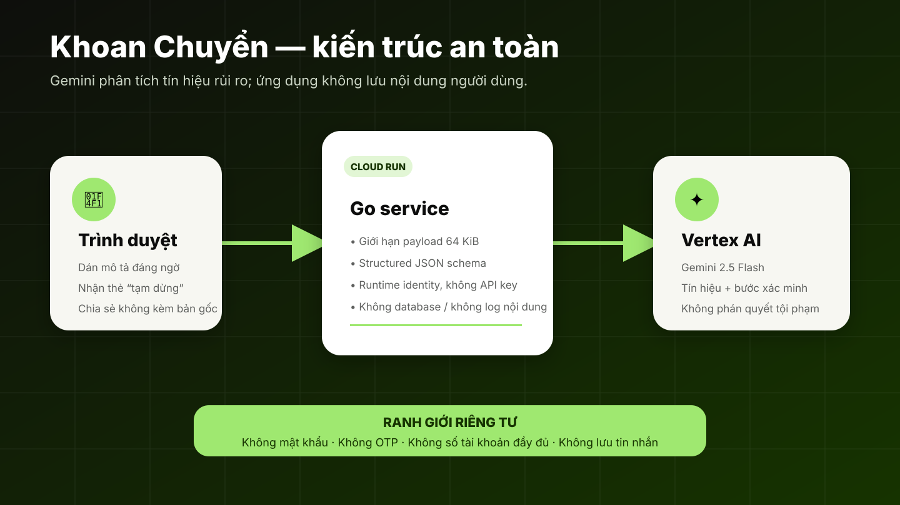

# Khoan Chuyển!

A Vietnamese, family-oriented scam-interruption web app for AI Riser Vietnam 2026.

> Scammers manufacture urgency. Khoan Chuyển manufactures a pause.

## Public application

https://khoan-chuyen-1011704041754.asia-southeast1.run.app

## Anonymous validation

The consented self-guided study uses only synthetic scenarios and collects no name, email, phone number, account number, OTP, password, or raw real-world message:

https://khoan-chuyen-1011704041754.asia-southeast1.run.app/validate.html

The protocol and evidence boundaries are documented in [`docs/validation-protocol.md`](docs/validation-protocol.md). No participant outcomes are claimed until genuine responses exist.

## What it does

- Turns suspicious Vietnamese messages or call descriptions into a structured “pause card.”
- Uses **Vertex AI Gemini 2.5 Flash** to identify observable urgency, payment, secrecy, impersonation, and implausible-return signals.
- Avoids declaring a person, account, or message criminal or safe.
- Provides independent verification steps and a privacy-preserving family-share action.
- Does not store submitted content; the service has no application database.

## Architecture



The Go service runs on Google Cloud Run and calls Vertex AI through a dedicated runtime service account. No model API key is shipped to the container or browser.

## Run locally

```bash
go test ./...
go run .
```

Open <http://localhost:8080>. Without cloud configuration, the app uses a clearly limited deterministic demo analyzer.

For the deployed keyless Vertex AI path, configure:

```bash
GOOGLE_CLOUD_PROJECT='project-id' \
GOOGLE_CLOUD_REGION='asia-southeast1' \
GEMINI_MODEL='gemini-2.5-flash' \
go run .
```

The runtime requires Google Application Default Credentials with Vertex AI access. Never commit credentials.

## Safety and privacy boundaries

- No criminal attribution and no promise that content is safe or fraudulent.
- Independent official-channel verification rather than links or phone numbers from the submitted message.
- Users are warned not to submit passwords, OTPs, or full account numbers.
- The application does not persist submitted messages.
- Share output excludes the original submitted message.
- Requests are size-limited and browser responses include CSP, frame, referrer, and MIME protections.

## Validation and competition materials

- [`docs/validation-protocol.md`](docs/validation-protocol.md) — consented evidence protocol and anonymous result sheet.
- [`docs/validation-scenarios.md`](docs/validation-scenarios.md) — synthetic risky, benign, and ambiguous test cases.
- [`docs/submission-package.md`](docs/submission-package.md) — requirement tracker, judge pitch, demo outline, and final checks.

No users, testimonials, impact outcomes, or prevented losses are claimed until real consented validation is completed.

## Quality gates

```bash
go test ./...
go vet ./...
go build ./...
curl -fsS http://localhost:8080/readyz
```
